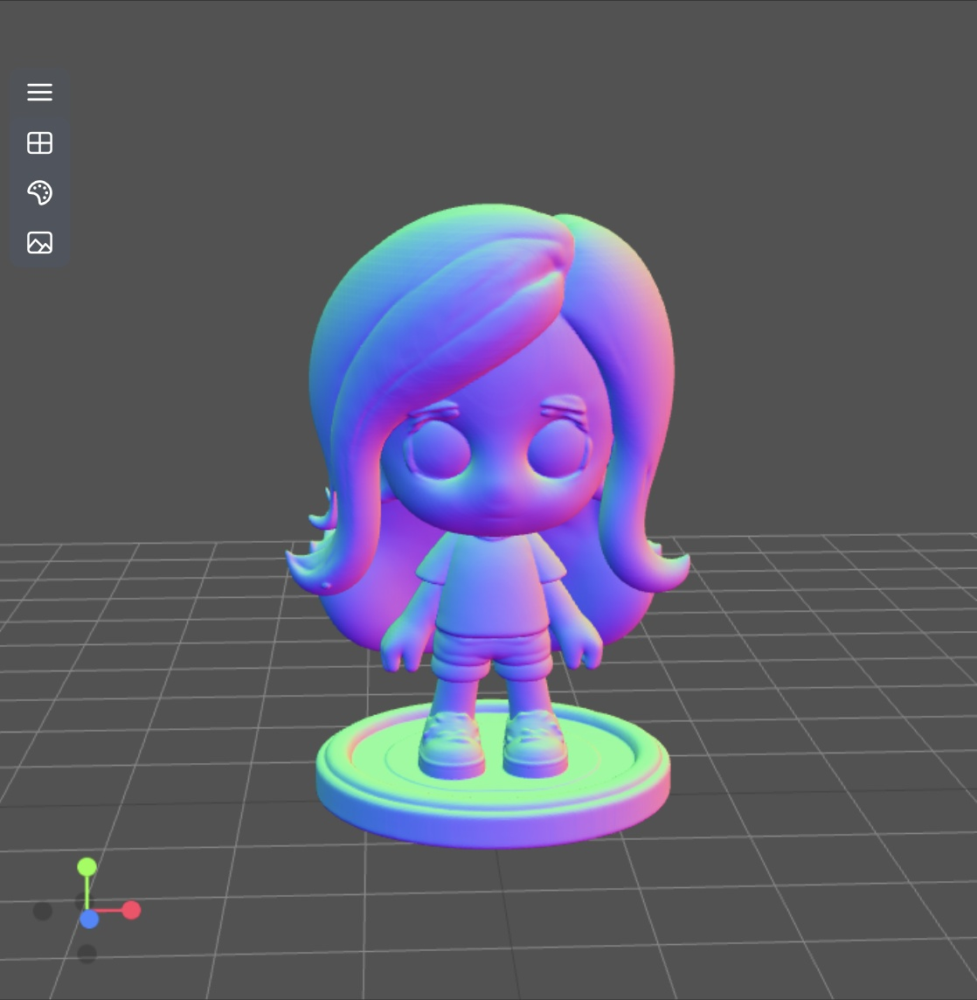
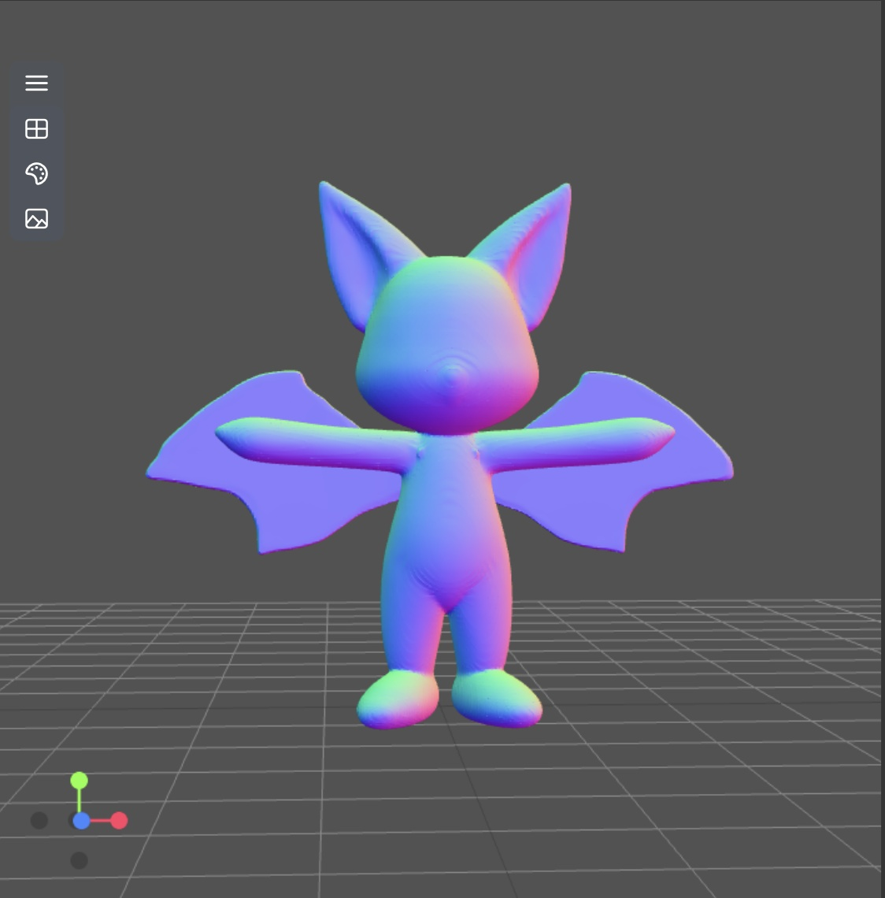
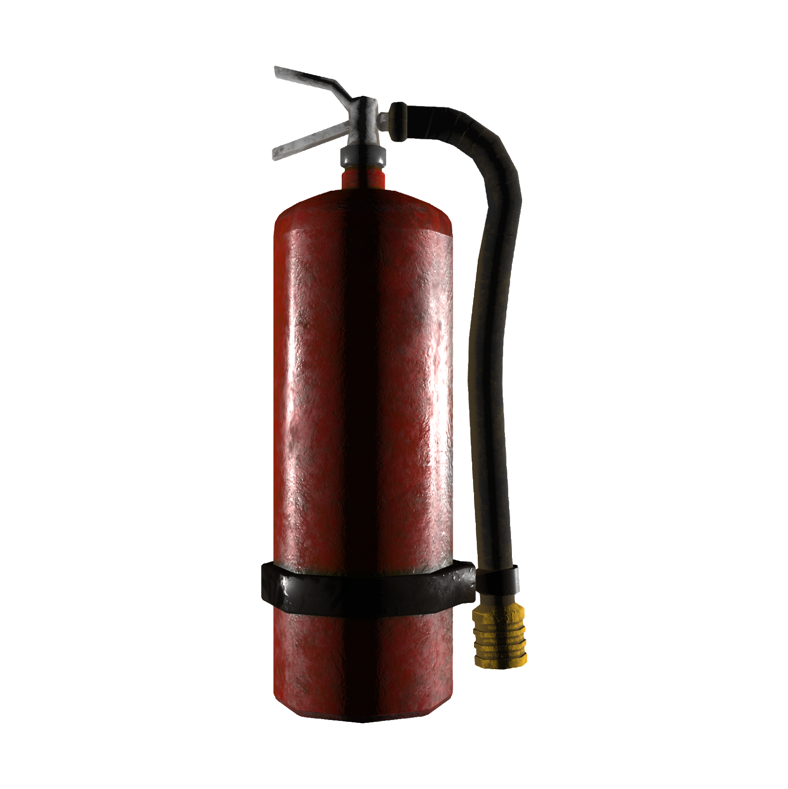
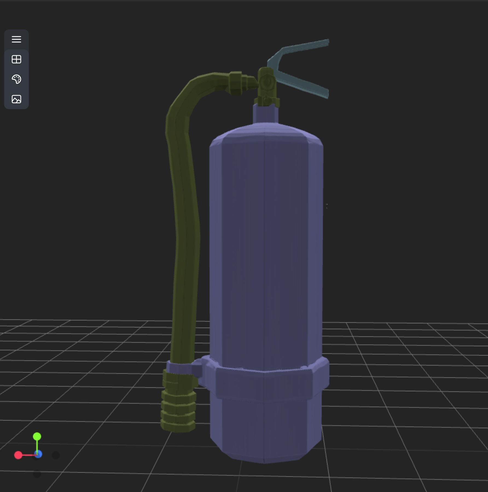

# TripoSG: High-Fidelity 3D Shape Synthesis using Large-Scale Rectified Flow Models

<div align="center">

[](https://yg256li.github.io/TripoSG-Page/)
[](https://arxiv.org/abs/2502.06608)
[](https://huggingface.co/VAST-AI/TripoSG)
[](https://huggingface.co/spaces/VAST-AI/TripoSG)
[](https://huggingface.co/spaces/VAST-AI/TripoSG-scribble)

**By [Tripo](https://www.tripo3d.ai)**

</div>


TripoSG is an advanced high-fidelity, high-quality and high-generalizability image-to-3D generation foundation model. It leverages large-scale rectified flow transformers, hybrid supervised training, and a high-quality dataset to achieve state-of-the-art performance in 3D shape generation.

## ✨ Key Features

- **High-Fidelity Generation**: Produces meshes with sharp geometric features, fine surface details, and complex structures
- **Semantic Consistency**: Generated shapes accurately reflect input image semantics and appearance
- **Strong Generalization**: Handles diverse input styles including photorealistic images, cartoons, and sketches
- **Robust Performance**: Creates coherent shapes even for challenging inputs with complex topology

## 🔬 Technical Highlights

- **Large-Scale Rectified Flow Transformer**: Combines RF's linear trajectory modeling with transformer architecture for stable, efficient training
- **Advanced VAE Architecture**: Uses Signed Distance Functions (SDFs) with hybrid supervision combining SDF loss, surface normal guidance, and eikonal loss
- **High-Quality Dataset**: Trained on 2 million meticulously curated Image-SDF pairs, ensuring superior output quality
- **Efficient Scaling**: Implements architecture optimizations for high performance even at smaller model scales

## 🔥 Updates

* [2025-04] Release TripoSG-scribble, a CFG-distilled, 512 token model for fast shape prototyping from scribble+prompt! Try the online demo [here](https://huggingface.co/spaces/VAST-AI/TripoSG-scribble).
* [2025-03] Release of TripoSG 1.5B parameter rectified flow model and VAE trained on 2048 latent tokens, along with inference code and interactive demo

## 🧩 ComfyUI Support

This is a wrapper implementation of TripoSG in [ComfyUI](https://github.com/comfyanonymous/ComfyUI).


### 🔨 Installation

To use these nodes, simply clone the repo to your ComfyUI custom nodes directory and restart ComfyUI. Then from the repo dir run:

```bash
pip install -r requirements.txt
```

You can then load the provided workflows and generate high-fidelity 3D meshes directly from images or scribbles.

### Update

**2025 Jul 23:**
- Add support for [PartCrafter](https://wgsxm.github.io/projects/partcrafter/) - a finetune of TripoSG.
- ⚠️ Breaking Change: `TripoSGInference` now return `TRIMESH` type. Use `SaveTrimesh` to export to 3D model. Or use `TrimeshToMesh` to convert back to ComfyUI native `MESH` format.


### Supported Models

The ComfyUI wrapper supports three different models:

- **TripoSG**: Standard high-fidelity image-to-3D model for detailed mesh generation
- **TripoSG-scribble**: CFG-distilled model for fast prototyping from scribbles + prompts
- **PartCrafter**: Multi-part generation model for complex object composition


### Available Nodes

**Core Nodes:**
- **TripoSG Model Loader**: Loads TripoSG, TripoSG-scribble, or PartCrafter models for inference.
- **TripoSG Prepare Image**: Preprocesses and crops input images for optimal 3D generation (used for standard TripoSG model).
- **TripoSG Inference**: Runs 3D mesh generation from an input image with optional conditioning.

**Conditioning Nodes:**
- **TripoSG Scribble Conditioning**: Prepares prompt and scribble confidence conditioning for the TripoSG-scribble model.
- **PartCrafter Conditioning**: Prepares settings for PartCrafter multi-part generation.

**Mesh Processing Nodes:**
- **Save Trimesh**: Exports TRIMESH objects to various 3D model formats (GLB, OBJ, PLY, STL, 3MF, DAE).
- **Mesh to Trimesh**: Converts ComfyUI MESH objects to TRIMESH objects.
- **Trimesh to Mesh**: Converts TRIMESH objects to ComfyUI MESH objects.
- **Simplify Mesh**: Reduces mesh complexity by decreasing face count (requires pymeshlab).


### Example Workflows
Example ComfyUI workflows are provided in [example_workflows](example_workflows/).

- [Image to 3D](example_workflows/image_to_3d.json): Standard image-to-3D workflow
<table>
<tr>
<td></td>
<td></td>
</tr>
</table>

- [Scribble to 3D](example_workflows/scribble_to_3d.json): Scribble+prompt to 3D workflow.
<table>
<tr>
<td></td>
<td></td>
</tr>
</table>

- [PartCrafter](example_workflows/image_to_3d_partcrafter.json): Generate 3D in multile parts.
<table>
<tr>
<td></td>
<td></td>
</tr>
</table>

## 💻 System Requirements

- CUDA-enabled GPU with at least 8GB VRAM

## 🤝 Community & Support

- **Issues & Discussions**: Use GitHub Issues for bug reports and feature requests.
- **Contributing**: We welcome contributions!

## 📚 Citation

```
@article{li2025triposg,
  title={TripoSG: High-Fidelity 3D Shape Synthesis using Large-Scale Rectified Flow Models},
  author={Li, Yangguang and Zou, Zi-Xin and Liu, Zexiang and Wang, Dehu and Liang, Yuan and Yu, Zhipeng and Liu, Xingchao and Guo, Yuan-Chen and Liang, Ding and Ouyang, Wanli and others},
  journal={arXiv preprint arXiv:2502.06608},
  year={2025}
}
```

## ⭐ Acknowledgements

We would like to thank the following open-source projects and research works that made TripoSG possible:

- [DINOv2](https://github.com/facebookresearch/dinov2) for their powerful visual features
- [RMBG-1.4](https://huggingface.co/briaai/RMBG-1.4) for background removal
- [🤗 Diffusers](https://github.com/huggingface/diffusers) for their excellent diffusion model framework
- [HunyuanDiT](https://github.com/Tencent/HunyuanDiT) for DiT
- [FlashVDM](https://github.com/Tencent/FlashVDM) for their lightning vecset decoder
- [3DShape2VecSet](https://github.com/1zb/3DShape2VecSet) for 3D shape representation

We are grateful to the broader research community for their open exploration and contributions to the field of 3D generation.
